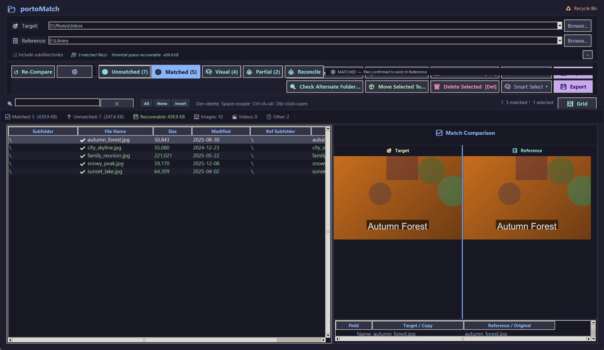
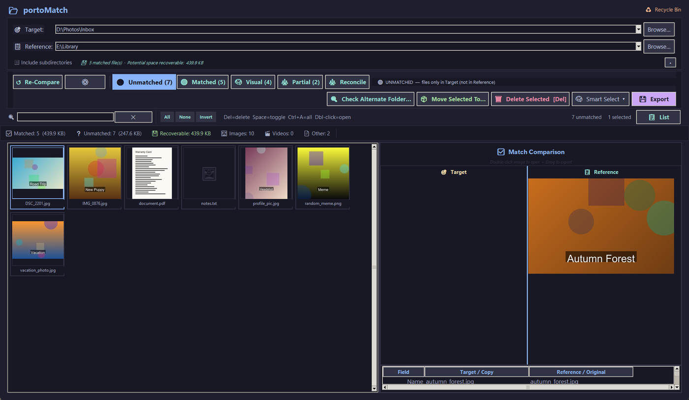
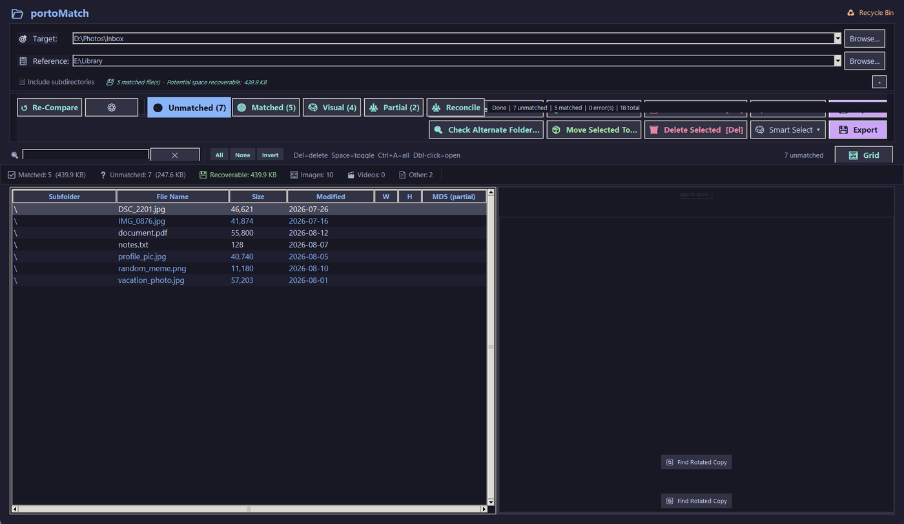

# portoMatch

**Find and remove duplicate files between two folders — without ever deleting something you don't already have safely backed up.**

portoMatch is a Windows desktop app for people with files in two places: a working folder and a backup drive, a downloads folder and a photo library, a laptop and a NAS. It scans both, tells you exactly which files in the folder you want to clean up already exist in your authoritative copy, and lets you clear only those — nothing is ever deleted from the reference folder.

This repository hosts **downloads only** — portoMatch's source stays private, since the
offline Pro licence key is derived in that source and a public copy would let anyone
forge one. Windows builds are published here under **Releases**; nothing else in this
repo runs or is installed.

---

## Why it's careful

Most "duplicate finders" happily delete whatever they flag. portoMatch is built the other way around: it only ever proposes removing a **target** file when it has confirmed a copy exists in the **reference**, it defaults deletions to the Recycle Bin, and it writes every removal to a CSV audit log. Deletions and moves are only ever proposed for **target** files; the only way anything reaches the reference folder is a file you explicitly promote into it.

---

## What it does

1. **Pick two folders** — a *Target* to clean up and a *Reference* that holds the authoritative copies.
2. **Compare** — every target file is checked against the reference using multiple signals: file size, modification time, image/video dimensions, a fast BLAKE2b partial hash, EXIF image IDs, and a perceptual (dHash) image fingerprint.
3. **Review** — results land in a list or a thumbnail gallery, grouped by how confident the match is, with a side-by-side preview and full metadata for any pair.
4. **Act** — delete confirmed duplicates (Recycle Bin or permanent), move them to a trash folder, or promote them, with smart rules to keep the reference copy and clear the target.

### Match confidence tiers

| Tier | Meaning |
|---|---|
| **Exact** | Size, timestamp, hash and dimensions all agree |
| **Strong** | Almost everything agrees, one minor discrepancy |
| **Review** | Size plus one other signal — worth a human glance |
| **Partial** | Same image content, different file metadata |
| **Visual** | Visually similar image within a fuzzy threshold |

---

## Screenshots

**Gallery view** — every target file as a thumbnail, so duplicates are obvious at a glance:

**Detail list** — sortable columns with sizes, dates, dimensions and partial hashes:

---

## Highlights

- **Signature cache** — hashes and dimensions are remembered per file, so re-scanning the same folders is dramatically faster.
- **Adaptive timestamp handling** — automatically detects and corrects for systematic clock offsets between drives (DST shifts, FAT32 rounding, NAS drift).
- **Perceptual image matching** — finds resized or re-encoded copies of the same photo, not just byte-identical duplicates.
- **Cold-storage manifests** — generate SHA-256 checksum manifests of archive drives to verify offline copies later.
- **Session save/restore** — pause a review and pick it up later.
- **Works over the network** — local drives, UNC paths (`\\NAS\Share`), and mapped drives.

---

## Download

Grab the latest `portoMatch-X.Y-win64.zip` from [Releases](../../releases/latest),
unzip it anywhere, and run `portoMatch.exe`. No installer, no admin rights. Your settings,
licence, caches and audit logs live right next to the exe; the only things that go to the
Windows temp folder are the thumbnail cache and the exe's own unpacked runtime.

### About the SmartScreen warning

This build is not code-signed (that costs money we're not spending yet), so Windows
will show **"Windows protected your PC"** the first time you run it. Click **More info →
Run anyway**. This is standard for small, independently-published Windows software — it
means Windows hasn't seen this specific file before, not that anything is wrong with it.
Check the `.sha256` file next to the zip if you want to verify the download yourself.

---

## Free vs. Pro

Everything below the line is free, no licence needed, no time limit, no nag beyond an
occasional reminder. A Pro licence removes that reminder, authorises commercial use, and
additionally unlocks:

- **Alternate layouts** — Gallery + Inspector, Dense List, and Compare-First views (switch anytime under View → Layout; Classic stays free).
- **Reconcile Mode** — a dual-pane backup audit for verifying an entire mirror/backup copy against its source.
- **Partial Match review** — a dedicated view for reviewing partial (not exact or visual) matches.
- **Signature cache** — remembers file signatures across sessions for much faster re-scans of large libraries, and powers **Find Rotated Copy**, which depends on it.
- **Cold Storage Pro** — multi-drive manifests, audits, spin-up reminders, and S.M.A.R.T. health checks that keep your cold-storage drives and backups verified, plus cold-storage cross-checks during a compare.
- **EXIF editor** and the **provenance row** — see (and edit) which software last touched a file.
- **Visual duplicates** in the single-folder Duplicate Finder.
- **Build Reference Index** — pre-index a large reference root for instant lookups on future scans.
- **Backup Sync Mode** — replays the deletions you made in a folder onto its backup copy, from the audit log, with a full preview before anything is removed.
- **Commercial use**, and no periodic reminder notice.

Everything else — comparing folders, side-by-side review, deleting/moving with an audit
trail, the Rejected workflow, Smart Select, session save/restore, cold-storage
manifests (Lite) — is free with no catch.

### Buying Pro

<!-- Lemon Squeezy purchase link — fill in once the store product is live -->
Buy a Pro licence: **[LS purchase link placeholder]**

---

## Activating a Pro licence

Your licence key is in the purchase receipt e-mail and on Lemon Squeezy's "My Orders"
page (format `XXXXXXXX-XXXX-XXXX-XXXX-XXXXXXXXXXXX`).

1. Download and run portoMatch (above) — the download itself is always free.
2. Open **Settings → Pro Licence…**
3. Paste the key and click **Activate**. The app contacts Lemon Squeezy once to activate
   this computer, then works completely offline; it re-checks the key quietly about once
   a week when you happen to be online.

Your key activates on up to 3 computers. To move it to a new machine, open
**Settings → Pro Licence…** on the old one and click **Deactivate** first.

---

## Privacy

portoMatch talks to the network for exactly two things. The update check can be switched
off in Settings; the licence check only happens if you activated a Lemon Squeezy key:

- **Update check** (once a day, or on demand via Help → Check for Updates…): fetches one
  small JSON file listing the latest release from this GitHub repo. Sends only an
  app-name/version header — nothing about you or your files.
- **Pro licence activation and re-validation** (only if you've entered a Lemon Squeezy
  key): sends the key and this machine's name to Lemon Squeezy once to activate, then a
  short silent re-check about once a week. Nothing about your files or usage.

Nothing else ever leaves your computer. Your files, filenames, and folder paths are
never sent anywhere.

---

## Full user guide

This page is the quick tour. For the complete walkthrough — every button, every mode, and the safety model in depth — see **[README_USER.md](README_USER.md)**.

---

## Questions

Open an issue on this repository, or reply to your Lemon Squeezy purchase receipt for
licensing questions.

---

*portoMatch by portoWorks.*
